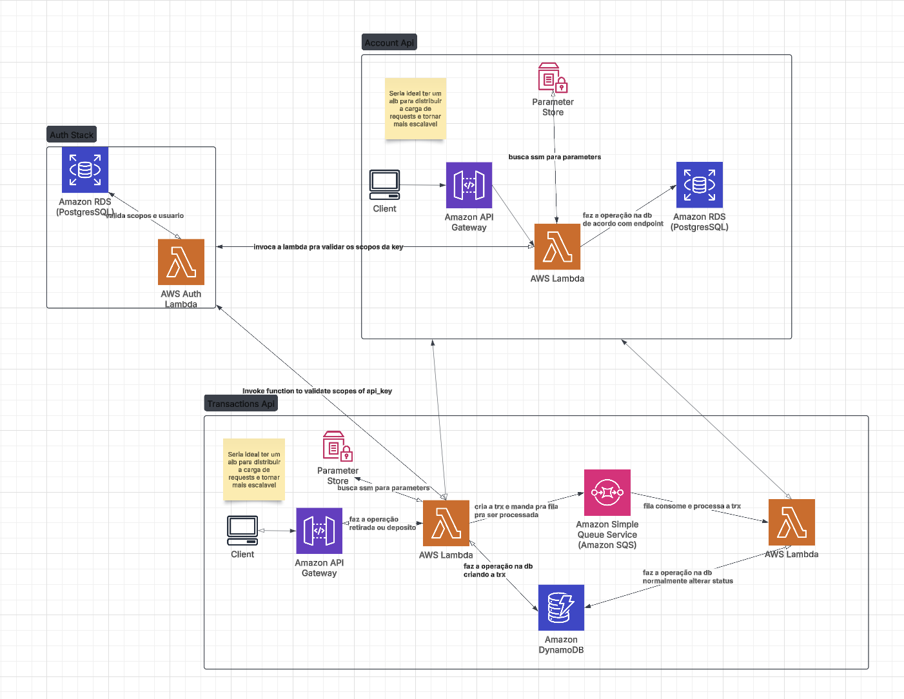
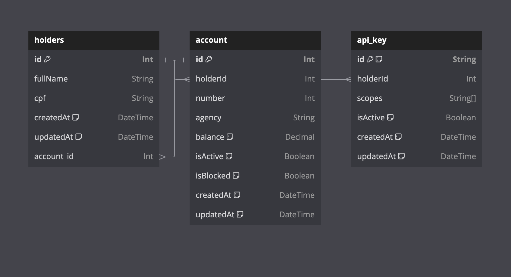

# Dock Digital Account - Serverless API

Este projeto implementa uma API Serverless para gerenciamento de contas digitais e transações financeiras usando **AWS Lambda**, **API Gateway** e **DynamoDB**, utilizando **Serverless Framework** e **AWS SDK v3**.

## Arquitetura do Projeto
O sistema é dividido em dois microserviços:

1. **Account API** (`account-api`): Gerencia contas digitais
   - Criar conta
   - Criar Portador
   - Consultar conta
   - Bloquear e desbloquear conta
   - Fechar conta

2. **Transactions API** (`transactions-api`): Gerencia operações financeiras
   - Realizar depósito
   - Realizar saque
   - Consultar extrato

Cada serviço é independente e possui seu próprio **serverless.yml**, bancos de dados e handlers.

---

## 📁 Estrutura de Diretórios
```plaintext
.
├── README.md
├── account-api
│   ├── docker-compose.yml
│   ├── package-lock.json
│   ├── package.json
│   ├── prisma
│   │   ├── migrations
│   │   │   ├── 20250130085348_
│   │   │   │   └── migration.sql
│   │   │   └── migration_lock.toml
│   │   └── schema.prisma
│   ├── serverless.yml
│   └── src
│       ├── config
│       │   └── prisma.js
│       ├── handlers
│       │   ├── auth.js
│       │   ├── blockAccount.js
│       │   ├── closeAccount.js
│       │   ├── createAccount.js
│       │   ├── createHolder.js
│       │   ├── deleteHolder.js
│       │   ├── getAccount.js
│       │   ├── unblockAccount.js
│       │   └── updateBalance.js
│       ├── tests
│       ├── utils
│       │   ├── cpfValid.js
│       │   ├── exception.js
│       │   ├── presenterFactory.js
│       │   └── statusCode.js
│       └── validation
│           ├── account.validation.js
│           └── holder.validation.js
├── arch.png
├── db-rds.png
└── transactions-api
    ├── docker-compose.yml
    ├── package-lock.json
    ├── package.json
    ├── serverless.yml
    └── src
        ├── handlers
        │   ├── deposit.js
        │   ├── getStatement.js
        │   ├── processTransaction.js
        │   └── withdraw.js
        ├── tests
        ├── utils
        │   ├── cpfValid.js
        │   ├── exception.js
        │   └── presenterFactory.js
        └── validations
            └── transactions.validations.js

17 directories, 38 files
```

## 🚀 Tecnologias Utilizadas
- **Node.js 20.x**
- **AWS Lambda**
- **Prisma**
- **Serverless Framework**
- **AWS SDK v3**
- **Docker**

---

## 🛠️ Configuração e Instalação
### **1️⃣ Clonar o repositório**
```sh
# Clonar o projeto
 git clone https://github.com/seu-usuario/dock-digital-account.git
 cd dock-digital-account
```

### **2️⃣ Instalar as dependências e configurar o espaço**
```sh
sudo bash .init.sh
```
Caso não for usar o script ou nao seja possivel.
## Passos para Configuração

### 1. Instalar Dependências

Para cada API que contém um `package.json`, siga os passos abaixo:

1. Navegue até o diretório da API:
   ```bash
   cd caminho/para/a/api
   ````
2. remover as dependencias
```bash
rm -rf node_modules package-lock.json
```
3. reinstalar as dependencias
```bash
npm install
```
4. iniciar docker compose
```bash
docker compose up -d
```
5. na pasta account-api
```bash
npx prisma migrate --dev
```
6. na pasta transactions-api
```bash
  aws dynamodb create-table \
      --table-name transactions \
      --attribute-definitions \
          AttributeName=transactionId,AttributeType=S \
          AttributeName=createdAt,AttributeType=S \
          AttributeName=accountNumber,AttributeType=S \
      --key-schema \
          AttributeName=transactionId,KeyType=HASH \
          AttributeName=createdAt,KeyType=RANGE \
      --billing-mode PAY_PER_REQUEST \
      --global-secondary-indexes '[
          {
              "IndexName": "AccountCreatedAtIndex",
              "KeySchema": [
                  {"AttributeName": "accountNumber", "KeyType": "HASH"},
                  {"AttributeName": "createdAt", "KeyType": "RANGE"}
              ],
              "Projection": {
                  "ProjectionType": "ALL"
              }
          }
      ]' \
      --endpoint-url http://localhost:8000
```
logo apos
```bash
  aws --endpoint-url=http://localhost:4566 sqs create-queue --queue-name transactions-queue --region sa-east-1
```

com isso voce tera os ambientes totalmente configurados para rodar offline e testar

### **3 Inicializar cada ambiente**
apenas precisara entrar em cada diretorio e rodar o comando (lembrar de rodar cada um em um terminal)
```sh 
npm run start 
```

### **4️⃣ Executar localmente**

---
## 📌 Endpoints da API
### **Account API** (Gerenciamento de Contas)
| Método  | Rota                      | Descrição          |
|---------|---------------------------|--------------------|
| POST    | `/holder`                 | Criar Portador     |
| DELETE  | `/holder/{cpf}`           | Deletar Portador   |
| POST    | `/accounts`               | Criar conta        |
| GET     | `/accounts/{cpf}`         | Consultar conta    |
| PATCH   | `/accounts/{cpf}/block`   | Bloquear conta     |
| PATCH   | `/accounts/{cpf}/unblock` | Desbloquear conta  |
| DELETE  | `/accounts/{cpf}`         | Fechar conta       |

### **Transactions API** (Operações Financeiras)
| Método  | Rota                        | Descrição         |
|---------|-----------------------------|-------------------|
| POST    | `/transactions/deposit`     | Realizar depósito |
| POST    | `/transactions/withdraw`    | Realizar saque    |
| GET     | `/transactions/statement`   | Consultar extrato |

---

## Design System


## Database


## Notações extras
[Notações](./notes.manifest)
